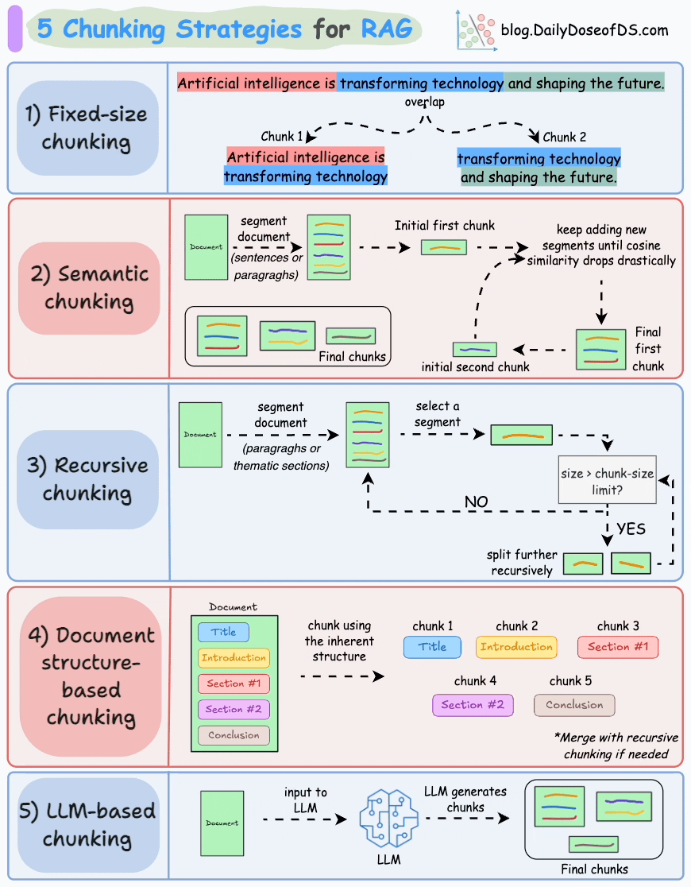

# Retrieval-Augmented Generation (RAG) System Documentation

Source: https://github.com/ALucek/RAG-Overview/blob/main/rag_breakdown.ipynb

## Overview

Retrieval-Augmented Generation (RAG) is a powerful technique that enhances Large Language Models (LLMs) by providing them with relevant, up-to-date context from external knowledge sources. This documentation explains how RAG systems work and provides implementation guidance.

## Why RAG Matters

Traditional LLMs have several limitations:
- **Knowledge cutoff**: Limited to training data up to a certain date
- **Domain specificity**: Lack deep knowledge in specialized fields
- **Proprietary data**: Cannot access private or organizational data
- **Hallucinations**: May generate incorrect information confidently

RAG addresses these issues by:
- Providing access to current, domain-specific information
- Enabling use of proprietary or private data
- Reducing hallucinations through grounded responses
- Maintaining LLM's reasoning capabilities

## Core Components

### 1. Knowledge Base Preparation

#### Text Processing
LLMs process text-based input. Raw documents (PDFs, Word docs, etc.) must be converted to text format:

```python
# Example: PDF to Markdown conversion
def convert_pdf_to_markdown(pdf_path: str) -> str:
    # Extract text from PDF
    # Convert tables/images to text representation
    # Structure content with markdown formatting
    return markdown_content
```

#### Chunking Strategy
LLMs have context window limits (typically 4K-128K tokens). Large documents must be split into manageable chunks:

```python
from langchain_text_splitters import MarkdownTextSplitter

splitter = MarkdownTextSplitter.from_tiktoken_encoder(
    encoding_name="cl100k_base",  # OpenAI's encoding
    chunk_size=1200,              # Target chunk size
    chunk_overlap=400,            # Overlap between chunks
    strip_whitespace=True
)

chunks = splitter.split_text(document_text)
```

**Chunking Best Practices:**
- Use semantic boundaries (paragraphs, sections)
- Maintain overlap for context continuity
- Consider token limits of your LLM
- Preserve document structure when possible



### 2. Embeddings

#### What are Embeddings?
Embeddings transform text into numerical vectors that capture semantic meaning:

```python
from sentence_transformers import SentenceTransformer

# Load pre-trained embedding model
embedding_model = SentenceTransformer('sentence-transformers/all-MiniLM-L6-v2')

# Convert text to vector
vector = embedding_model.encode("Your text here")
# Result: 384-dimensional vector for MiniLM
```

#### Semantic Similarity
Embeddings enable mathematical comparison of text similarity:

```python
# Calculate similarity between texts
similarity_score = embedding_model.similarity(
    embedding_model.encode("cat"),
    embedding_model.encode("dog")
)
# Result: ~0.66 (cats and dogs are similar animals)
```

#### Visualization
Embeddings can be visualized in reduced dimensions:

```python
from sklearn.manifold import TSNE
import plotly.graph_objs as go

# Reduce 384D embeddings to 3D for visualization
tsne = TSNE(n_components=3, perplexity=10, random_state=42)
reduced_embeddings = tsne.fit_transform(embeddings_matrix)

# Create 3D scatter plot
fig = go.Figure(data=[go.Scatter3d(
    x=reduced_embeddings[:, 0],
    y=reduced_embeddings[:, 1],
    z=reduced_embeddings[:, 2],
    mode='markers+text',
    text=words,
    marker=dict(size=5, opacity=0.7)
)])
```

### 3. Vector Databases

#### Purpose
Vector databases store and efficiently retrieve embeddings:

```python
import chromadb

# Initialize vector database
client = chromadb.PersistentClient(path="./vector_db")
collection = client.get_or_create_collection(name="knowledge_base")

# Store document chunks
collection.add(
    documents=chunks,
    ids=[f"chunk_{i}" for i in range(len(chunks))]
)
```

#### Retrieval
Find most relevant documents for a query:

```python
# Query the vector database
results = collection.query(
    query_texts=["What is the maximum power consumption?"],
    n_results=5  # Return top 5 most similar chunks
)

# Results contain:
# - documents: The actual text chunks
# - distances: Similarity scores (lower = more similar)
# - ids: Unique identifiers for each chunk
```

## Complete RAG Pipeline

### Architecture Overview

```
User Query --> Embedding --> Retrieval --> Augmentation --> Generation --> Response
     |           |           |           |           |           |
   "Question" --> Vector --> Top K Chunks --> Context --> LLM --> Grounded Answer
```

### Implementation

```python
class RAGSystem:
    def __init__(self):
        self.embedding_model = SentenceTransformer('all-MiniLM-L6-v2')
        self.vector_db = chromadb.PersistentClient(path="./db")
        self.collection = self.vector_db.get_or_create_collection("docs")
        self.llm_client = OpenAI()  # or other LLM provider

    def add_documents(self, documents: list[str]):
        """Add documents to the knowledge base."""
        # Split documents into chunks
        chunks = self._chunk_documents(documents)

        # Generate embeddings
        embeddings = self.embedding_model.encode(chunks)

        # Store in vector database
        self.collection.add(
            documents=chunks,
            embeddings=embeddings.tolist(),
            ids=[f"doc_{i}" for i in range(len(chunks))]
        )

    def query(self, question: str, top_k: int = 5) -> str:
        """Answer a question using RAG."""
        # 1. Embed the question
        question_embedding = self.embedding_model.encode(question)

        # 2. Retrieve relevant context
        results = self.collection.query(
            query_embeddings=[question_embedding.tolist()],
            n_results=top_k
        )

        # 3. Prepare context
        context_chunks = results['documents'][0]
        context = "\n\n".join(context_chunks)

        # 4. Generate augmented prompt
        prompt = f"""Use the provided context to answer the question accurately.

Context:
{context}

Question: {question}

Answer:"""

        # 5. Generate response
        response = self.llm_client.chat.completions.create(
            model="gpt-4",
            messages=[{"role": "user", "content": prompt}],
            max_tokens=1000,
            temperature=0.1
        )

        return response.choices[0].message.content

    def _chunk_documents(self, documents: list[str]) -> list[str]:
        """Split documents into chunks."""
        splitter = MarkdownTextSplitter.from_tiktoken_encoder(
            encoding_name="cl100k_base",
            chunk_size=1000,
            chunk_overlap=200
        )

        all_chunks = []
        for doc in documents:
            chunks = splitter.split_text(doc)
            all_chunks.extend(chunks)

        return all_chunks
```

## Advanced RAG Techniques

### 1. Query Expansion
Enhance queries for better retrieval:

```python
def expand_query(query: str) -> list[str]:
    """Generate multiple query variations."""
    expansions = [
        query,
        f"What is {query}?",
        f"Explain {query}",
        f"Details about {query}"
    ]
    return expansions
```

### 2. Re-ranking
Improve retrieval quality:

```python
def rerank_results(query: str, chunks: list[str]) -> list[str]:
    """Re-rank chunks using cross-encoder model."""
    from sentence_transformers import CrossEncoder

    cross_encoder = CrossEncoder('cross-encoder/ms-marco-MiniLM-L-6-v2')
    pairs = [[query, chunk] for chunk in chunks]
    scores = cross_encoder.predict(pairs)

    # Sort by scores
    ranked_chunks = [chunk for _, chunk in sorted(zip(scores, chunks), reverse=True)]
    return ranked_chunks
```

### 3. Multi-stage Retrieval
Combine different retrieval strategies:

```python
def multi_stage_retrieval(query: str) -> list[str]:
    """Use multiple retrieval strategies."""
    # Stage 1: Semantic search
    semantic_results = vector_search(query, top_k=20)

    # Stage 2: Keyword search
    keyword_results = keyword_search(query, top_k=20)

    # Stage 3: Combine and re-rank
    combined = list(set(semantic_results + keyword_results))
    reranked = rerank_results(query, combined)

    return reranked[:5]
```

## Performance Optimization

### Indexing Strategies
- **HNSW (Hierarchical Navigable Small World)**: Fast approximate nearest neighbor search
- **IVF (Inverted File Index)**: Partition-based indexing for large datasets
- **PQ (Product Quantization)**: Compress vectors for memory efficiency

### Caching
```python
from functools import lru_cache

@lru_cache(maxsize=1000)
def cached_embedding(text: str) -> list[float]:
    """Cache embeddings to avoid recomputation."""
    return embedding_model.encode(text)
```

### Batch Processing
```python
def batch_embed_and_store(documents: list[str], batch_size: int = 32):
    """Process documents in batches for efficiency."""
    for i in range(0, len(documents), batch_size):
        batch = documents[i:i + batch_size]
        embeddings = embedding_model.encode(batch)

        # Store batch in vector database
        collection.add(
            documents=batch,
            embeddings=embeddings.tolist(),
            ids=[f"doc_{i+j}" for j in range(len(batch))]
        )
```

## Evaluation Metrics

### Retrieval Quality
- **Precision@K**: Fraction of retrieved documents that are relevant
- **Recall@K**: Fraction of relevant documents that are retrieved
- **Mean Reciprocal Rank (MRR)**: Average of reciprocal ranks
- **Normalized Discounted Cumulative Gain (NDCG)**: Ranking quality metric

### Generation Quality
- **Faithfulness**: Does the answer contradict the context?
- **Relevance**: Does the answer address the question?
- **Completeness**: Does the answer fully address the question?
- **Groundedness**: Is the answer supported by the context?

## Production Considerations

### Scalability
- **Vector Database Choice**: Pinecone, Weaviate, Qdrant, ChromaDB
- **Embedding Model**: Balance speed vs. quality (MiniLM, MPNet, etc.)
- **Caching Strategy**: Redis for frequently accessed embeddings
- **Load Balancing**: Distribute requests across multiple instances

### Monitoring
```python
def monitor_rag_performance():
    """Monitor RAG system performance."""
    metrics = {
        "avg_query_time": measure_average_query_time(),
        "cache_hit_rate": measure_cache_effectiveness(),
        "retrieval_precision": measure_retrieval_accuracy(),
        "user_satisfaction": measure_user_feedback()
    }
    return metrics
```

### Security
- **Input Validation**: Sanitize all user inputs
- **Access Control**: Implement workspace/document-level permissions
- **Audit Logging**: Track all queries and responses
- **Data Privacy**: Ensure sensitive information is protected

## Common Pitfalls

### 1. Chunk Size Issues
- **Too small**: Loss of context and meaning
- **Too large**: Exceeds LLM context window
- **Solution**: Experiment with different sizes (500-2000 tokens)

### 2. Embedding Model Mismatch
- **Problem**: Using different models for indexing vs. querying
- **Solution**: Always use the same embedding model

### 3. Poor Retrieval Quality
- **Problem**: Irrelevant chunks retrieved
- **Solutions**:
  - Improve chunking strategy
  - Use re-ranking
  - Implement query expansion
  - Fine-tune embedding model

### 4. Hallucinations
- **Problem**: LLM generates incorrect information despite context
- **Solutions**:
  - Improve prompt engineering
  - Add confidence scoring
  - Implement fact-checking mechanisms

## Future Directions

### Advanced RAG Techniques
- **Graph-based Retrieval**: Use knowledge graphs for complex relationships
- **Multi-modal RAG**: Handle images, audio, and video content
- **Conversational RAG**: Maintain context across multiple interactions
- **Self-improving RAG**: Learn from user feedback to improve retrieval

### Integration Patterns
- **API-first Design**: Expose RAG as microservice
- **Streaming Responses**: Real-time generation for better UX
- **Hybrid Approaches**: Combine RAG with fine-tuned models
- **Federated RAG**: Query across multiple knowledge bases

## Conclusion

RAG represents a significant advancement in AI systems, enabling LLMs to provide accurate, up-to-date, and contextually relevant responses. By combining the reasoning capabilities of LLMs with efficient retrieval from external knowledge sources, RAG systems can tackle complex domain-specific problems that were previously challenging for AI systems.

The key to successful RAG implementation lies in:
1. **Quality knowledge base preparation**
2. **Effective chunking strategies**
3. **Appropriate embedding models**
4. **Efficient vector databases**
5. **Well-engineered retrieval and generation pipelines**

As the field continues to evolve, RAG will play an increasingly important role in building reliable and capable AI systems.